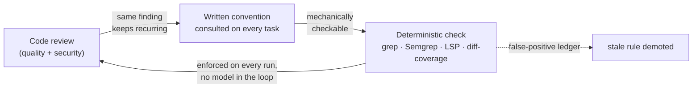

# Sysop

**Recurring review findings become rules it enforces for you.**

Sysop brings a full team's engineering rigor to one builder and an AI — from first plan to merge. You bring the idea worth building; Sysop brings the discipline. It's a self-improving development workflow — where "self-improving" means recurring review findings are promoted into written conventions and compiled to machine checks, with you adjudicating every promotion; nothing learns autonomously — extracted from the GDP Query System project (71 review rounds, 3,298 findings, 78 promoted conventions as of 2026-07).

## The loop



The workflow carries a project from brain-dump to merged PR — and every review feeds the loop above: a finding that keeps recurring is promoted to a written convention, and the mechanically checkable ones become deterministic checks the computer runs identically every time, no model in the loop. It's the difference between advice a model is asked to remember and checks the computer runs. The effect shows in the data: as the convention map grew, reviews shifted from critical defects to nits — with the limits of that evidence stated right beside it ([the monograph](./docs/workflow.html), Fig. 7 and § IV).

Sysop is open because the corpus is the point: every pack convention is a documented, generalized failure mode of an AI coding agent, earned from recurring findings on a real project — and `/contribute-convention` lets your project's locally-promoted rules join it, generalized to placeholder vocabulary and shown to you exactly as they'd be filed. Contributions land as issues and are maintainer-authored into the packs under a published [trust policy](./CONTRIBUTING.md#contribution-trust-policy). The floor this raises matters most when generation is cheap: the maps and checks are designed to catch the extra strays a lighter coding model produces, with a stronger reviewer only where judgment is needed ([model roles](./docs/configuration.md#models) are one config key).

## Is this for you?

Sysop pays for itself in specific situations and asks more than it's worth in others — worth naming before you install. (The long version is the [monograph's audience section](./docs/workflow.html).)

**Built for:**

- **A solo engineer shipping a real product with AI.** You're producing more code than you can review line by line, and you can't add reviewers — so the review has to become structural. This is the case the workflow was extracted from, and the one with the dogfood evidence behind it.
- **A small team shipping via agentic tools** — with one boundary named up front: Sysop coordinates parallel *agent sessions* under a **single human reviewer**. Two people sharing one queue (assignment, review handoff) is a deliberate non-goal today.
- **A builder still growing the judgment the gates assume.** Opt-in guided mode (one section in your project's `CLAUDE.md`) makes each gate state the decision plainly, stress-test its own recommendation, and hand you only the calls that are genuinely yours — the review bar itself doesn't move. Newer and less proven than the solo path.

**Probably not for you:**

- **The project fits in your head.** Weekend tools, prototypes, quick scripts: reviewing your own diff costs less than running the process, and the convention loop pays off over months of review rounds — a short-lived project pays the overhead and never collects.
- **You're not working in Claude Code (yet).** The lifecycle skills are Claude Code slash commands today. The companion layer — checks, hooks, maps, workflow docs — is plain files with no Claude dependency, designed to run under any capable agent; that design is why this is a "not yet" rather than a "no". But design intent is not an earned record: every real run so far has been Claude Code, so on another agent you would be the first and the integration work would be yours. We would rather name that than sell portability we haven't tested.
- **You're on a tight token budget.** The deep skills (planning, adversarial review, audits) default to Opus-class models on purpose; expect real token spend — a Claude Max plan or API budget is the comfortable fit. Remapping the deep-reasoning tier to a cheaper model is [one config key](./docs/configuration.md#models), but the defaults assume you're paying for judgment.

**Want less than all of it?** `--mode loop` installs only the convention loop — the review and audit skills, the checks, and the findings ledger they maintain — into a repo where you keep your own branching and merge workflow. No task queue, no worktrees, no merge gate; the smallest way to run Sysop's rules-and-checks engine against an existing project, and the one to reach for if the full workflow reads as more than you want to adopt today. Before it shipped, this mode was run once, end-to-end, against a real ~60k-line open-source codebase — three review rounds in, a freshly mechanized convention caught an instance no round had filed. [Loop mode](./docs/loop-mode.md) is the walkthrough; [install modes](./docs/install-and-update.md#install-modes-full-and-loop) the reference.

## What you get

- **A full lifecycle, not a review bolt-on** — `/intake` turns a brain-dump into a validated task queue (`/onboard` brings an existing project in); plans get adversarial review before code; every task builds in an isolated git worktree; documentation is deferred and batched; dual-mode review (`/codebase-review` for quality, `/security-audit` for OWASP) feeds the convention loop; `/review-close` is the single human merge gate.
- **Deterministic enforcement** — recurring findings become grep and Semgrep AST rules in a shared registry, alongside a language-server pass (`pyright`/`tsc`) and a diff-coverage gate on the paths you mark critical — enforced identically on every run, with a false-positive ledger that flags stale rules for demotion.
- **Parallel building under one reviewer** — locks and worktrees let `/auto-build` build batches of tasks concurrently while you stay the only merge gate.
- **A feedback loop you control** — every install seeds `SYSOP_ISSUES.md`, a friction log; `/report-issues` files the pain upstream and `/share-wins` shares what worked, each entry only with your explicit consent. It points outward too: things that have been considered and parked are published in [Ideas](https://github.com/getsysop/sysop/discussions/categories/ideas), each with an honest note on why it isn't built — 👍 is prioritization signal, not a promise.
- **Reversible by design** — everything lands as tracked files plus two git hooks, and the hooks ship as skeletons that block nothing until your project fills in its checks ([what the hooks do](./docs/install-and-update.md#what-the-git-hooks-do)); see [Backing out](#backing-out).

## Quickstart

```bash
git clone https://github.com/getsysop/sysop.git
bash sysop/install.sh /path/to/your/project --packs auto
cd /path/to/your/project && git add .claude/ sysop/ tasks/ CLAUDE.md .gitignore && git commit -m "chore: install Sysop"
```

> **Prerequisites:** git, bash 4+, and Python 3 with PyYAML (`pip install pyyaml`) — Sysop's own check runner and task validator are Python scripts, whatever your project's stack. **macOS:** the stock `/bin/bash` is 3.2 — run `brew install bash` first (Homebrew's bash lands on your PATH ahead of the system one). **Windows:** run under WSL.

`--packs auto` detects your stack (`pyproject.toml` → python, `next.config.js` → nextjs-react, and so on) and installs the matching convention packs; omit `--packs` for an interactive picker, add `--dry-run` to preview without writing, or `--mode loop` for the [smallest install](./docs/loop-mode.md) — just the convention loop, no lifecycle. The commit matters: `/claim-task` builds in git worktrees, which only see committed files. Claude Code users can additionally install the slash commands as a plugin — `/plugin marketplace add getsysop/sysop`, then `/plugin install sysop@sysop`. The two paths are a pair, not alternatives: the plugin delivers only the slash commands, and everything they operate on — scripts, checks, maps, hooks — arrives via the bash installer above, so on Claude Code you run both. Updating, pinning to a release, plugin mechanics, permissions: [docs/install-and-update.md](./docs/install-and-update.md).

## Documentation

- **Start building** — [`docs/getting-started.md`](./docs/getting-started.md): a hands-on walkthrough from install to your first shipped change (install → `/intake` → `/claim-task` → `/review-close`).
- **Just the loop** — [`docs/loop-mode.md`](./docs/loop-mode.md): the `--mode loop` walkthrough — run only the convention loop against an existing repo, keeping your own branching and merge workflow.
- **Why it's built this way** — [`docs/workflow.html`](./docs/workflow.html): a visual monograph on the lifecycle, the parallel orchestrator, the convention loop — and what the data behind it can and can't prove.
- **Install, update, pin, remove** — [`docs/install-and-update.md`](./docs/install-and-update.md): both install paths in full, the update contract, `--ref` release pinning, required permissions, backing out.
- **Customize** — [`docs/configuration.md`](./docs/configuration.md): behavior via `CLAUDE.md`, the never-managed overlay files (conventions, checks, substitutions), model role mapping.
- **The process spec** — [`core/companion/docs/WORKFLOW.md`](./core/companion/docs/WORKFLOW.md) (authoritative), [`WORKFLOW_GUIDE.md`](./core/companion/docs/WORKFLOW_GUIDE.md) (human-readable).
- **How it got here** — [`docs/history.md`](./docs/history.md), the short outsider-legible version; [`PHASE_LOG.md`](./PHASE_LOG.md) is the unabridged per-phase log.
- **The evidence, sampled** — [`docs/one-rule.md`](./docs/one-rule.md): one rule traced end to end, from recurring review finding to a compiled check you can run before installing anything.

## Status

In daily use by its first consumers (BeanRider and the project it was extracted from). Five convention packs are populated from real projects — each pack's convention map is the full rule list, browsable before you install: [python](./packs/python/companion/convention_map.md), [postgres](./packs/postgres/companion/convention_map.md), [nextjs-react](./packs/nextjs-react/companion/convention_map.md), [llm](./packs/llm/companion/convention_map.md), [beancount](./packs/beancount/companion/convention_map.md); six more are placeholders that populate from real use. The rules ship in placeholder vocabulary (`<api module>`, `<auth module>`) so they transfer between projects — [Anatomy of a pack rule](./docs/packs.md) shows one rule in both its original concrete form and its shipped form, explains how the rules reach your code, and states where each pack was mined from and how far it travels. Development history is public in [`PHASE_LOG.md`](./PHASE_LOG.md) — one entry per phase; the full repo layout is in [docs/install-and-update.md](./docs/install-and-update.md#repo-layout).

## Backing out

Everything Sysop writes is a tracked file plus one set of git hooks, so reversing it — a single task claim, or the whole tool — is a clean git operation.

- **Un-claim a task:** `bash sysop/scripts/claim_task.sh --release <TASK-ID>` (from the main checkout) removes the task's worktree — never the main one — flips its `status:` back to `open`, deletes the lock, and prints the commit to run. `--force` discards uncommitted worktree work; `--delete-branch` drops the feature branch too.
- **Remove Sysop entirely:** revert the `chore: install Sysop` commit if nothing has touched the payload since; otherwise `rm -rf sysop/` (everything Sysop owns lives under one dir), then revert the `.claude/` merge and the `CLAUDE.md` / `.gitignore` appends. Because the vendor files live under `sysop/` and never mingle with your own, there's nothing to pick apart. Then disarm the hooks — the one untracked surface: `rm -f .git/hooks/pre-commit .git/hooks/pre-merge-commit` (any hooks of your own that the installer displaced were backed up alongside as `*.bak.<timestamp>`). Plugin users: also `/plugin uninstall <plugin>@sysop`.

The full walkthrough — including the manual reversal path when PyYAML is missing, and which `tasks/` files are Sysop's versus yours — is in [docs/install-and-update.md § Backing out](./docs/install-and-update.md#backing-out).

## Support expectations

Sysop is built for my own daily use and published in that spirit. Issues and PRs are welcome and reviewed as time permits — there is no SLA, no roadmap commitment, and no backwards-compatibility guarantee during early development. Plugin manifests stay unversioned by design (every commit is the latest); reviewed checkpoints are cut as tagged releases you can pin to via the bash installer's `--ref` flag (see [SECURITY.md](SECURITY.md)). If it's useful to you, use it and fork freely — it's MIT-licensed.

## Prior art

`/intake`'s brain-dump → playback → sounding-board interaction shape draws on the `interview-me` pattern from [Addy Osmani's agent-skills](https://github.com/addyosmani/agent-skills) collection (MIT-licensed). Sysop's skill is written from scratch for its intent-layer (`tasks/vision.md` + `tasks/decisions.md`) and task-emission model — no prose was copied or paraphrased; the credit is for the conversational pattern.

## Provenance

Extracted from `gdp-query-system` (private) via `git filter-repo` on 2026-04-30; the source commit is tagged there as `wade-flow-extract-base`. The public repository is a fresh-history snapshot of a private development repo — the private history's commit messages and preserved file history reference the production application the workflow was extracted from, and stay private. [`PHASE_LOG.md`](./PHASE_LOG.md) is the public development history; the review-round provenance of individual conventions is carried in the convention maps themselves.

The public history therefore advances in **squash snapshots**, not granular commits — a policy, not neglect. Each public commit is titled `sysop public snapshot (private <hash>)`, naming the private commit it mirrors; one lands when a development phase (or a small bundle of them) closes, which is several a week while development is active. Before every push the mirrored tree is re-scanned for private-history identifiers — that leak-scan discipline is what the commit granularity is traded for. The public pulse is [`PHASE_LOG.md`](./PHASE_LOG.md), one dated entry per phase; and for the evidence trail behind a single rule — review-round finding → promoted convention → the compiled check you can run yourself — see [One rule, end to end](./docs/one-rule.md).
